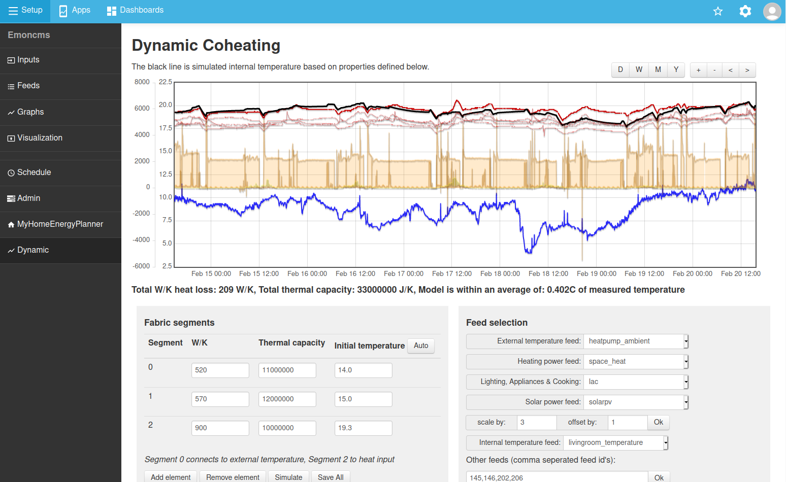

## Dynamic - Open Source Dynamic Building Energy Model

An open source simple RC dynamic building energy model. Combine input power, temperature and solar data from monitoring with a simple RC model to estimate the heat loss rate of the building.

Repository also contains direct heating and heatpump simulation example.

This work is all open source - under GNU Affero General Public License
Part of the OpenEnergyMonitor project:
[http://openenergymonitor.org](http://openenergymonitor.org)

### Documentation

- [A simple dynamic building model](docs/dynamicmodel.md)
- [A simple radiator model](docs/radiatormodel.md)
- [A simple heatpump model](docs/heatpumpmodel.md)

### Dynamic model based coheating test 

A multi-stage dynamic RC type model of a building appears to give a good fit to monitored internal temperature in a simple building.

### Spreadsheet version of dynamic model

See: [dynamic_model.ods](files/dynamic_model.ods)
